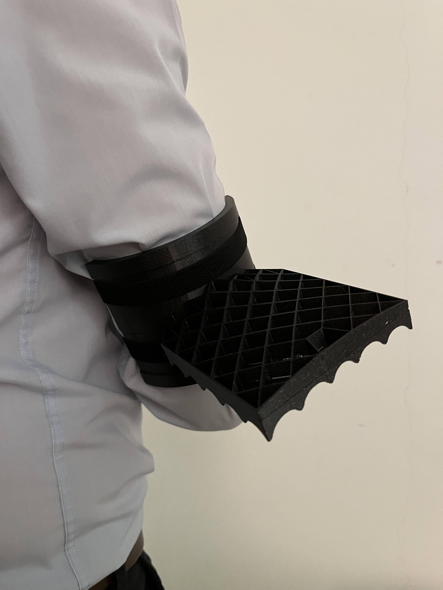
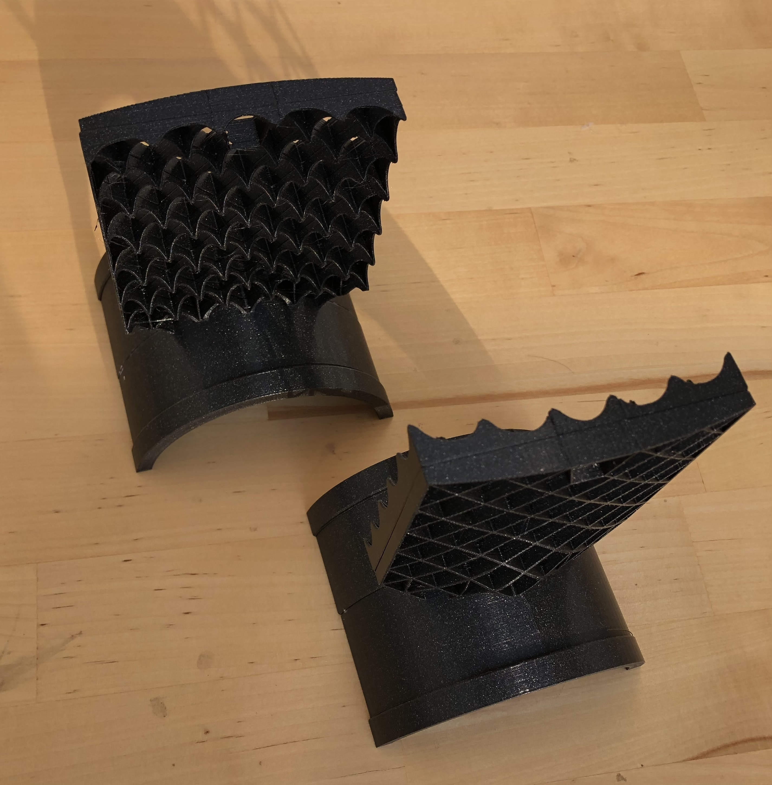
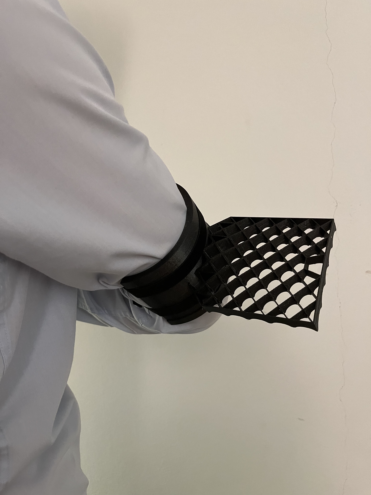
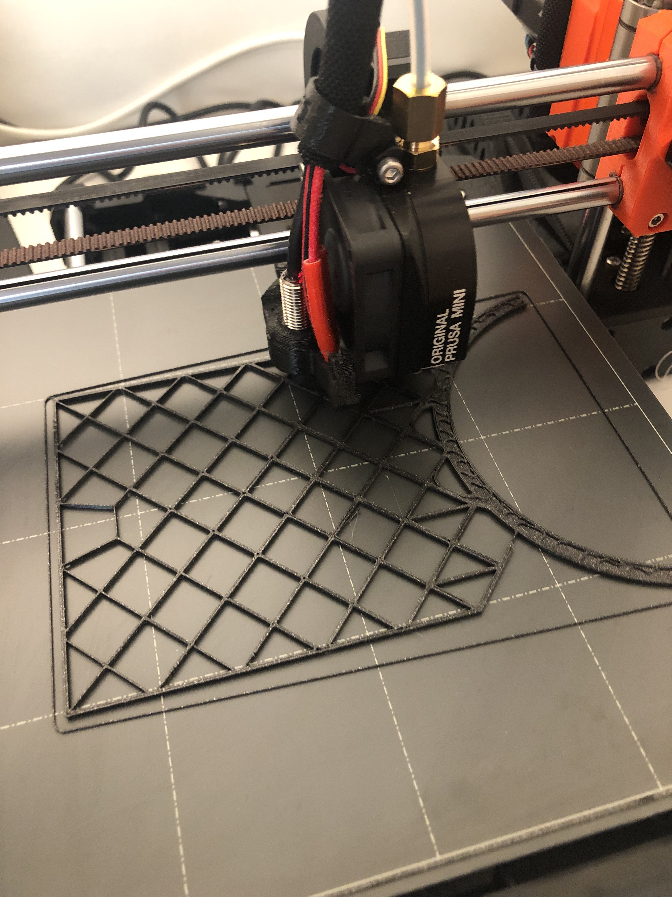
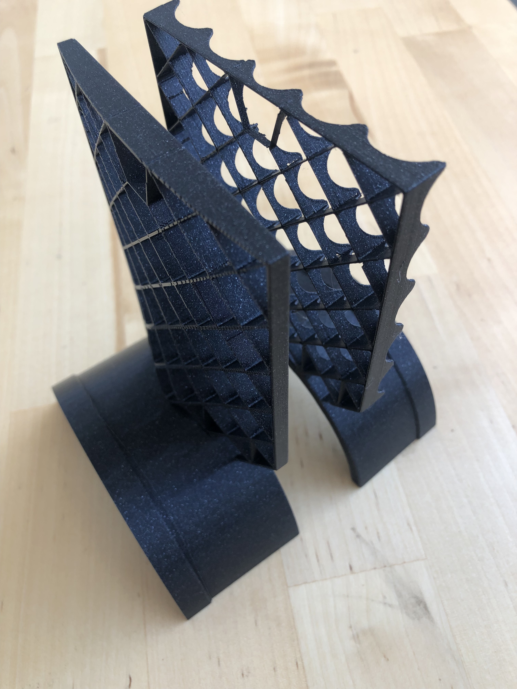
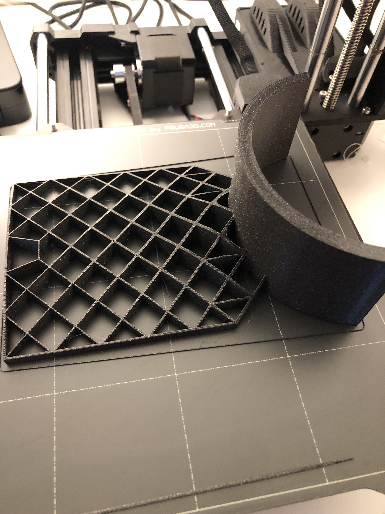
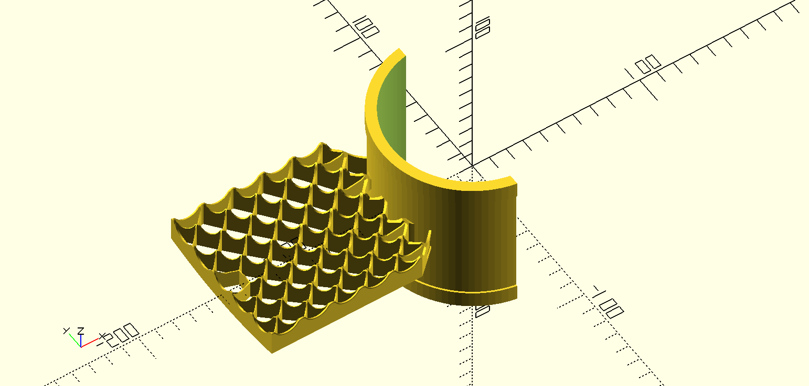
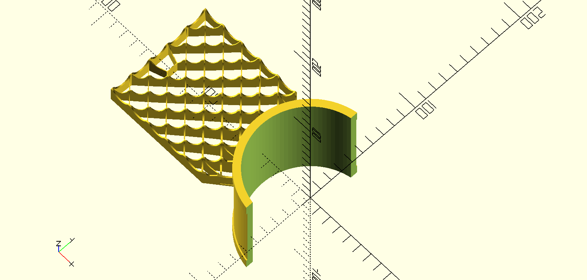
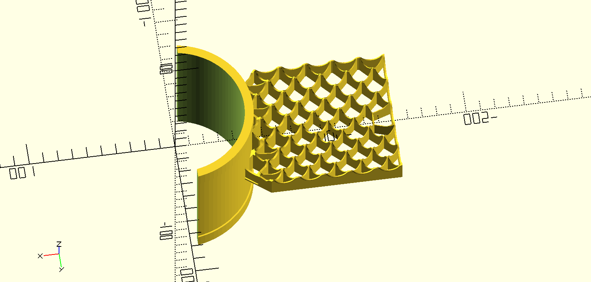

# Grid Fin Carnival Mask 🎭

This is a carnival mask to be worn on an arm, so you can be Falcon 9 🚀. 
This work is based on [this model](https://www.printables.com/model/142891-grid-fin-spacex-falcon-9) of SpaceX Grid fin created by [Tim O'Brien](https://github.com/t413).

I modified the [STL model](https://www.printables.com/model/142891-grid-fin-spacex-falcon-9) from Printables in OpenSCAD to have the round part which wraps round the arm with a groove to hold the rubber band.

The mask consists of two grid fins which were both printed in two parts on Prusa Mini and glued together.

<table>
<tr>
    <td></td>
    <td></td>
    <td></td>
</tr>
<tr>
    <td></td>
    <td></td>
    <td></td>
</tr>
<tr>
    <td></td>
    <td></td>
    <td></td>
</tr>
</table>
